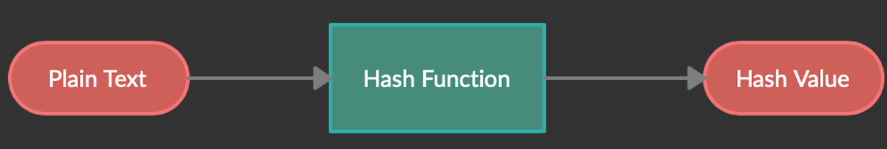
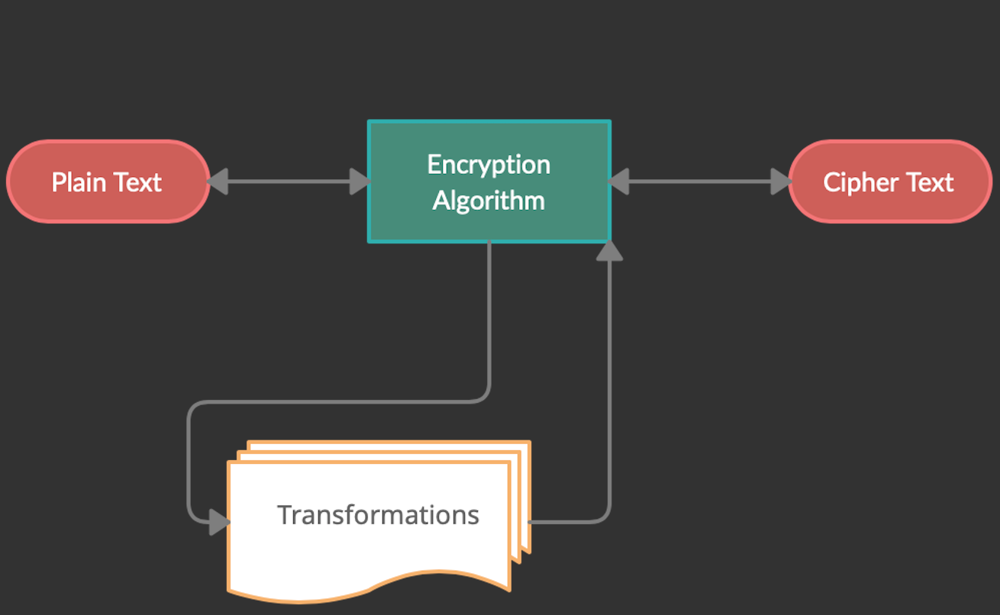
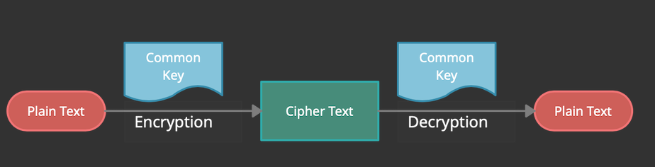
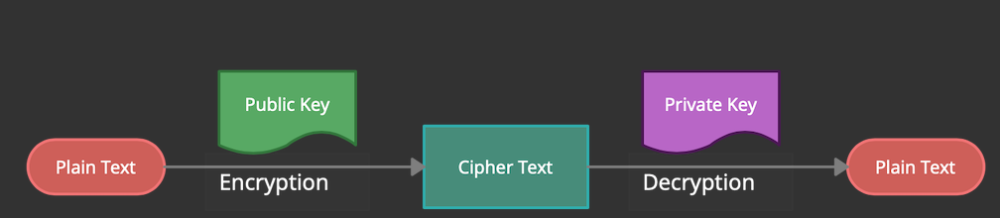
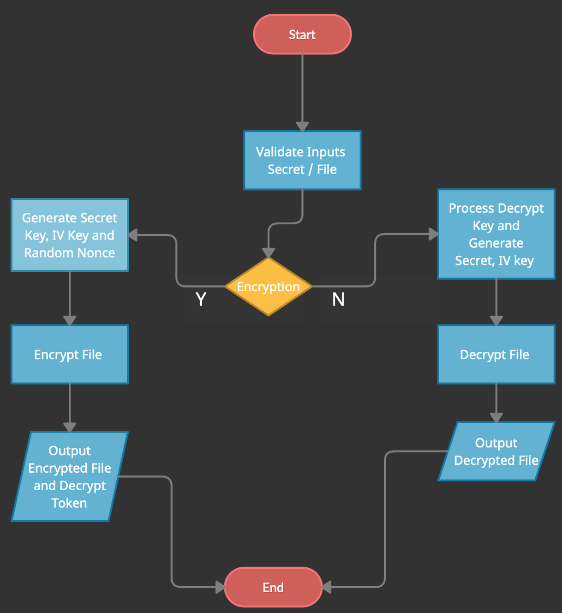
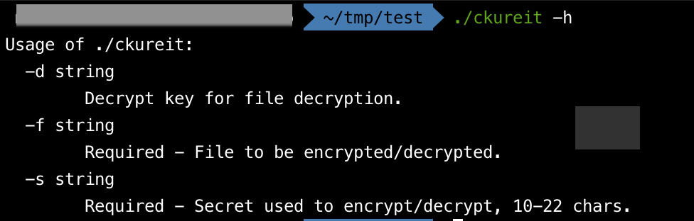
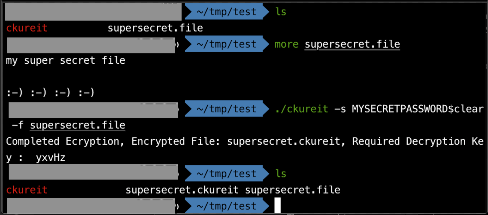
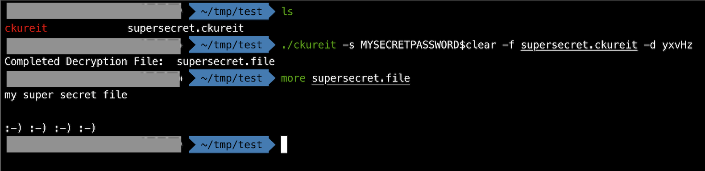

# Lets CKUREIT (...Secure It..)

## TL;DR

CKUREIT - Simple utility to encrypt and decrypt files, Multi Factor Encryption solution. Use a secret to perform AES encryption on a file, which returns unique secure token. Use same secret and the secure token to decrypt file.

We look briefly at hashing and encryption, finishing up with CKUREIT implementation.

## Show me the code
CKUREIT - https://github.com/MalcolmPereira/ckureit 

## Introduction

Encryption allows for sharing and storing data locally or in the cloud with high confidence that sensitive information is not easily hacked. There are countless solutions available out there that can be used to encrypt files, web application or utilities to download some free, others paid.

Examples:

- Freecrypt <https://freecrypt.org>
- Encrypt <https://encrypt.one>
- Encipher <https://encipher.it>
- Macpaw <https://macpaw.com/encrypto>
- Veracrypt <https://www.veracrypt.fr>

All these solutions use well know encryption standards to protect information, wrapping proven encryption schemes to secure data.

For free web services one would still argue do I really want to upload my documents to those free site to get them encrypted, should I be paying a premium to encrypt my documents ?

As a developer,  I am adding my take on encrypting files via simple golang implementation that wraps crypto/aes package. I thought about Multi Factor Encryption i.e needing a unique secured token when decrypting the file.

Use the utility to encrypt and decrypt file using AES-256 encryption.

Some use cases:

- Saving documents in free cloud storage and then decrypt them locally on a different device.
- Sharing and saving documents over email.
- Saving documents in unencrypted usb drive or shared storage.

Have validated the utility on mac and windows.

## 1. Hashing

Many a times hashing and encryption are confused, sadly sometimes used interchangeably. Hashing and Encrypting are two distinct mechanisms to secure data and are not same.

Hashing is a one way function i.e. it is not possible to undo a hash to obtain original content. Encryption is a two-way function, We can decrypt encrypted data back to its original form.

Hashing should always be used for saving password i.e we should never store original password value rather only hash value and always compare hash values when validating passwords. Hashing a given unique input returns the same hash value, applied hash function is  deterministic returning same hash value for the same input.

Hashing generates a fixed length hash output for input of any length. Basic premise of hashing involves following

- Input of any length
- Mathematical Hash Function
- Output, which is the Hash Value and always a fixed length



Salt is used to make hash generation stronger. Salt is a unique, randomly generated string that is added to input string as part of hashing process. Salting makes is harder to crack passwords.

There are two types of Hash Functions; Password Hash Functions and CryptoGraphic Hash Functions.

### 1.1 Password Hash Functions

Password Hash Functions are slow generating hash function. As the name implies primarily used for storing passwords. Password Hash Functions take the password string to hash and a strong salt, modern password hash functions provides functions to generate salt or auto generate unique salts when hashing password string. Password Hash Functions also expose a compare function to validate a string against previously generated hash value.

Some examples of Password Hash Functions:

- Argon2 <https://argon2.online>
- Bcrypt <https://en.wikipedia.org/wiki/Bcrypt>
- PBKDF2 <https://en.wikipedia.org/wiki/PBKDF2>

### 1.2 CryptoGraphic Hash Functions

Cryptographic hash functions are mathematical algorithm that takes data of any length and returns calculated value of fixed size called hash value or message digest.  These are very fast and always used to validate integrity of data. Examples: validate checksums of files, compare arbitrary saved data against provided input.

Cryptographic hash functions are mathematical algorithm that takes data of any length and returns calculated value of fixed size called hash value or message digest.  These are very fast and always used to validate integrity of data. Examples: validate checksums of files, compare arbitrary saved data against provided input, Digital Signatures.

Some well know Cryptographic Hash Functions include,

- SHA-3 <https://en.wikipedia.org/wiki/SHA-3>
- BLAKE-3 <https://en.wikipedia.org/wiki/BLAKE>
- SHA-2 <https://en.wikipedia.org/wiki/SHA-2> (SHA-256)

Cryptographic hash functions that should not be used anymore

- MD5 <https://en.wikipedia.org/wiki/MD5>
- SHA-1 <https://en.wikipedia.org/wiki/SHA-1>

## 2. Encryption

Encryption is used to encode data making it very very hard to read. Encryption converts original plain text information into an encoded form called cipher text. The process of encoding plain text information into cipher text is called encryption or ciphering while retrieving plain text data from cipher text is called decryption or deciphering.



Encryption is the process that scramble data in such a way that it can be only unscrambled back by a secret code or a key, this is called the cryptographic key.  The cryptographic key is based on mathematical algorithms that has been agreed on by all parties dealing with the encrypted data. This cryptographic keys provides data security to the data.

The cryptographic key operates on blocks of data. Cryptographic algorithms called the block cipher works with fixed block of data namely, 16, 32, 64 bits and so on to encrypt blocks of data. Block ciphers use cryptographic key of fixed size namely 128, 256, 512 and so on, larger the key size stronger the encryption and slower the encryption process.

Based on this cryptographic key used for encryption, we have two types of encryption; Symmetric Key Encryption and Asymmetric Key Encryption.

### 2.1 Symmetric Key Encryption

In Symmetric Key Encryption, the same key is used for encryption and decryption. Any parties involved  in secure communication must have access to same key for encryption and decryption.



Commonly used Symmetric Key Encryption algorithms include:

- AES <https://en.wikipedia.org/wiki/Advanced_Encryption_Standard>
- Triple DES (3DES or TDES) <https://en.wikipedia.org/wiki/Triple_DES>
- SNOW <https://en.wikipedia.org/wiki/SNOW>

### 2.2 Asymmetric Key Encryption

In Asymmetric Key Encryption, different keys are used for encryption and decryption. This is also called Public Key Infrastructure in which a public key is used for encryption and private key for decryption. The public key is available to everyone, however private key is kept secret and only used for decryption.



Asymmetric Key Encryption is used in everyday communication over internet for TLS communications, i.e. all services accessed using https protocol.

Commonly used Symmetric Key Encryption algorithms include:

- RSA <https://en.wikipedia.org/wiki/RSA_(cryptosystem)>
- Elliptic Curve Cryptography <https://en.wikipedia.org/wiki/Elliptic-curve_cryptography>

## 3. AES Encryption

Advanced Encryption Standard (AES) is a Symmetric Key Encryption using same key for encryption and decryption. AES is chosen by U.S. government to protect classified information. AES is used worldwide and implemented in software and hardware to encrypt sensitive data.

AES works with block size of 128 bits and includes three block ciphers ; AES-128, AES-192 and AES-256 having key lengths of 128, 192 and 256 respectively

AES blocks cipher runs transformation rounds to convert data into cipher text. Each transformation round consists of several processing steps and secret key. The number of transformation rounds are determined by the key length.

- 128-bit Keys 10 Transformation Rounds
- 192-bit Keys 12 Transformation Rounds
- 256-bit Keys 14 Transformation Rounds

The transformation rounds are applied in reverse when converting cipher text to plain text.

## 4. CKUREIT Implementation

CKUREIT (to be read as secure it) is a golang implementation. Basic flow includes validating input secret key and file name for encryption and check if decrypt token is provided in which case perform decryption.

The entered secret key is manipulated by adding dynamically generated nonce to create secret key and IV key for file encryption. Part of generated nonce is returned as a decrypt key and the other part is encrypted along with the file.

During file decryption the decrypt key along with the secret is used to recreate secret key and IV key for file decryption.



### Example CKUREIT Help:

```
    ./ckureit -h
```


### Example CKUREIT File Encryption:

```
    ./ckureit -s <secret> -f <file name>

    ./ckureit -s SuperSECRETPaswword$121 -f supersecretFile.file
```


### Example CKUREIT File Decryption:

```
    ./ckureit -s <secret> -f <file name> -d <decrypt key>

    ./ckureit -s SuperSECRETPaswword$121 -f supersecretFile.ckureit -d XyZ12
```



